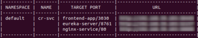

CarRental is sample enterprise REST application designed to support 
process of booking vehicles in a car rental company. 
Application consists of 2 main parts - main page allowing browsing 
and book cars and profile page allowing performing various actions 
associated with bookings, users or vehicles, depending on permissions 
he has (e.g. user can see here list of his bookings, change password, 
update profile settings; employee can update booking status, 
add or edit new vehicles; admin can assign permissions to user, etc) - 
all features were described in section [Features](#features).


Application is implemented in microservices architecture as multi module 
project stored in single git repository (monorepo architecture) managed by 
Gradle (composite build feature was used). Backend consists of 8 
microservices implemented in Spring Boot, stored as separate projects 
in 'api' directory; frontend was implemented in React and consists of 
6 subprojects stored in 'frontend-app' directory (separate subproject for 
each page) managed by webpack. Application supports different various 
deployment methods - deployment as single application as monolith using 
embedded Tomcat or Tomcat standalone server, deployment as 
microservices using docker or kubernetes - all details about deployment were 
described in detail in section 
[Setup](#setup).

# Features

## Main Page

### Profile Page

TODO: describe menu appearance depending on permission user has

### Reservation Page

### Login Page

### Registration Page

### Reset Password Page

# Software requirements

During development below programs were used:

- Java 11.0.21
- RabbitMQ 3.9.13
- Node.js v16.20.0
- Yarn 1.22.19
- Gradle 7.5.1
- PostgreSQL 14.10
- Docker 24.0.7
- Minikube v1.31.2

# Setup

### Frontend

1. Go to `frontend-app` directory.
2. Install all dependencies using yarn - execute below command:
    ```
    yarn install
    ```
    it will automatically execute `yarn install` in all 
    subprojects and install required dependencies
3. Compile project using below command:
    ```
    yarn compile
    ```
    it will automatically compile all subprojects to **frontend-app/dist** directory
4. Deploy application using below command (application is deployed using express server):
    ```
    yarn deploy
    ```
    to deploy application over https use below command:
    ```
    yarn deploy --useHttps --httpsKey ~/client-key.pem --httpsCert ~/client-cert.pem
    ```

To clean frontend-app compilation output or installed packages, below commands were implemented:
- `yarn clean` - remove **dist**
- `yarn clean -f` - remove **dist** and **node_modules**
- `yarn clean -a -f` - remove **dist** and **node_modules** in all subprojects

### Database setup

In case of monolith setup by default H2 database is used.
In case of microservices separate service with PostgreSQL database is created for each microservice.

If You want to create separate PostgreSQL instance You have 2 options:

1. Setup DB using docker

    1. Go to **setup/database**
    2. Execute `sudo docker compose up car-rental-database`

2. Setup DB using gradle tasks

    1. Install and configure PostgreSQL database server
    2. Connect to psql server and create **carrental** database using below commands:

    ```
    sudo -u postgres -i psql
    CREATE DATABASE carrental;
    \q
    ```
    3. Go to **setup/database**
    4. Execute `../../gradlew recreateDatabase` to fill database with demo data

Then You need to change database connection properties. 
By default, H2 database is used with below properties:
```
spring.datasource.url=jdbc:h2:mem:car-rental;MODE=LEGACY
spring.datasource.driverClassName=org.h2.Driver
spring.datasource.username=sa
spring.datasource.password=
spring.jpa.database-platform=org.hibernate.dialect.H2Dialect
```

If You want to use PostgreSQL separate DB instance You need to set below properties:
```
spring.datasource.url=jdbc:postgresql://localhost:5432/carrental
spring.datasource.driverClassName=org.postgresql.Driver
spring.datasource.username=postgres
spring.datasource.password=postgres
spring.jpa.database-platform=org.hibernate.dialect.PostgreSQLDialect
```

Above properties needs to be set in below file:
1. in case of monolith setup - **setup/monolith/src/main/resources/application.properties**
2. in case of microservices setup, it needs to be changed in all
microservices' application.properties configuration files - **api/{microservice-name}/src/main/resources/application.properties**

## Setup backend

### Monolith

> Before monolith setup install and configure RabbitMQ - see [Software requirements](#software-requirements)

a) embedded Tomcat - using gradle **bootRun** task

1. Go to **setup/monolith**
2. Execute `../../gradlew bootRun`

b) standalone Tomcat

1. Go to **setup/monolith/tomcat**
2. Execute `../../../gradlew clean setupAppTomcat`
3. To see startup logs run `tail -f build/setup/tomcat/logs/catalina.out`
4. Go to http://localhost:3030

To stop tomcat execute:
- `../../../gradlew tomcatShutdown`

To start tomcat again after setup execute:
- `../../../gradlew tomcatStartup`
  
### Microservices

#### Docker

1. Install and configure docker
2. Go to **setup/microservices/docker** and execute below command:
    ```
    sudo docker compose build
    ```
3. Once the docker images build have finished, execute below command:
    ```
    sudo docker compose up
    ```
4. Go to http://localhost:3030

#### Kubernetes

1. install and configure minikube
2. Execute `minikube start`
    > by default minikube VM is configured to use 2GB RAM memory - you 
    > need to increase this size - during development it was tested using 5GB,
    > with 2GB it was not possible to compile frontend-app

3. Switch to minikube docker in your terminal - execute below command:
    ```
    eval $(minikube -p minikube docker-env)
    ```
4. Get minikube IP - execute below command
   ```
   minikube ip
   ```
5. Set IP in all `*_HOSTNAME` properties (replace `<HOSTNAME>` by minikube IP) 
    in 2 below files
    - `setup/microservices/kubernetes/.env`
    - `setup/microservices/kubernetes/docker-compose.yml`

    e.g.
    
    ```
    AUTH_SERVICE_HOSTNAME: "192.168.11.123"
    BOOKING_SERVICE_HOSTNAME: "192.168.11.123"
    RATING_SERVICE_HOSTNAME: "192.168.11.123"
    STORAGE_STUB_SERVICE_HOSTNAME: "192.168.11.123"
    USER_SERVICE_HOSTNAME: "192.168.11.123"
    VEHICLE_SERVICE_HOSTNAME: "192.168.11.123"
    FRONTEND_APP_HOSTNAME: "192.168.11.123"
    ```

6. Go to `setup/microservices/kubernetes`
7. Build docker images using below command
    ```
    docker compose build
    ```
    > if you assigned too low amount of RAM to minikube VM, building
    > all images at once can freeze or take a really long time - to
    > work around that problem you can build images separately one after
    > another, using e.g. below command
    >  ```
    >  docker compose build frontend-app
    >  docker compose build user-service vehicle-service rating-service
    >  docker compose build eureka-server auth-service booking-service
    >  docker compose build mail-service storage-service-stub
    >  ```
8. Create below alias:
    ```
    alias kubectl='minikube kubectl --'
    ```
9. Create application deployment and services using deployment.yml file - execute
below command:
    ```
    kubectl apply -f deployment.yaml
    ```
10. Wait until kubernetes deployment is finished. You can check that using logs:
    - below commands to check if deployment/pod/service was created:
      ```
      kubectl get deployment
      kubectl get pods
      kubectl get svc
      ```
    - below command to check 
      ```
      kubectl logs cr-dep-5jg839furi-fjgur -c booking-service -f
      ```
11. Get service url using below command:
    ```
    minikube service --all
    ```
    
12. Go to url assigned to `frontend-app/3030`