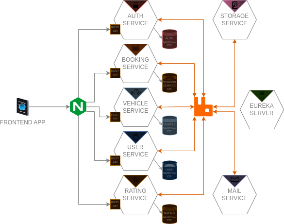
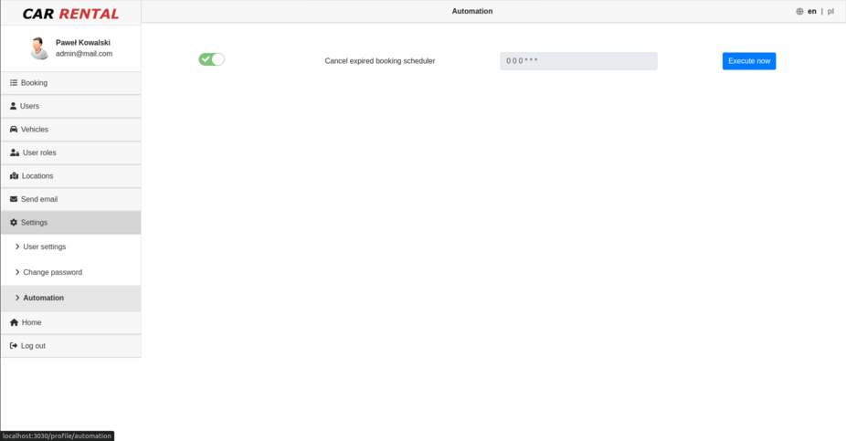
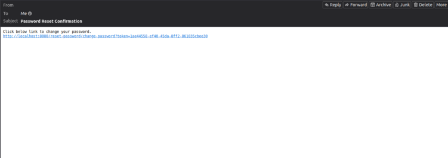

<p align="center">
  
</p>

CarRental is sample enterprise REST application designed to support process of booking vehicles in a car rental company. 
Application consists of 2 main parts - main page for browsing and booking cars and profile page for performing 
various actions associated with managing bookings, users or vehicles, depending on permissions he has (e.g. regular user 
can see here list of his bookings, change password, update profile settings; employee can update booking status, add or 
edit new vehicles; admin can assign permissions to user, etc) - all features were described in 
section [Features](#features).

<p float="left" align="center">
  
  
</p>

Application is implemented in microservices architecture as multi module projects stored in single git repository 
(monorepo architecture) managed by Gradle (composite build feature was used). Backend consists of 8 microservices 
implemented in Spring Boot, stored as separate projects in 'api' directory. Frontend was implemented in React and 
consists of 6 subprojects stored in `frontend-app` directory (separate subproject for each page) and managed by webpack. 
Application supports various deployment methods - deployment as single monolith application using embedded 
Tomcat or Tomcat standalone server, deployment as microservices using docker or kubernetes - all details about 
deployment were described in detail in section [Setup](#setup).

<p align="center">
  
</p>

1. [Features](#features)
    1. [Main Page](#main-page)
    2. [Profile Page](#profile-page)
        1. [Booking Management](#booking-management)
        2. [User List](#user-list)
        3. [Vehicle List](#vehicle-list)
        4. [Locations List](#locations-list)
        4. [User Roles List](#user-roles-list)
        5. [Settings](#settings)
    3. [Reservation Page](#reservation-page)
    4. [Login Page](#login-page)
    5. [Registration Page](#registration-page)
    6. [Reset Password Page](#reset-password-page)
2. [Software requirements](#software-requirements)
3. [Setup](#setup)
    1. [Frontend](#frontend)
    2. [Database](#database)
    3. [Mail](#mail)
    4. [Backend](#backend)
        1. [Monolith](#monolith)
        2. [Microservices](#microservices)
            - [Docker](#docker)
            - [Kubernetes](#kubernetes)
4. [Technical description](#technical-description)
    1. [API](#api)
    2. [Authentication](#authentication)
    3. [Nginx](#nginx)
    4. [RabbitMQ](#rabbitmq)
    5. [Microservices](#microservices)
    6. [Frontend architecture](#frontend-architecture)

# Features

CarRental application consists of 6 subpages - main page, user profile page, reservation page, login page, user 
registration page and reset password page. Each page is compiled by webpack into a separate 'js' bundle and then 
served by an Express framework.

## Main Page

**Main page** is base page of entire application. It allows accessing other subpages of the application - reservation 
page (via vehicle reservation widget on a home page), login page, user profile page, user registration page.
It also allows browsing and filtering vehicles, checking 'Special Offers', reading company details or contacting with 
company by filling email form and clicking send. It also contains vehicle details page which lists all vehicle details 
and allows read and add new comments, reserve vehicle, etc.

<p float="left" align="center">
  
  
</p>

<p float="left" align="center">
  
  
  
</p>

<p float="left" align="center">
  
  
  
</p>

### Profile Page

Profile page allows user to perform actions associated with personal settings (changing email, birthdate, etc), managing
bookings (cancel, change status), managing users (change user data, assign permission, send email), managing locations
(add new or display its list), managing vehicles (edit vehicle data, add a new vehicle).

<p float="left" align="center">
  
  
  <br>
  <em>Difference in appearance of menu for a regular and an admin user</em>
</p>

Tables used to display bookings, users or vehicles data supports pagination, sorting, filtering and translations 
(translations management is implemented on the frontend, sorting, pagination and filtering is executed by the backend).

<p float="left" align="center">
  
  
  
</p>

<p float="left" align="center">
  
  
  
</p>

#### Booking Management

This section contains 7 sub sections. Below 3 subsections displays data of a regular user bookings - allows displaying
bookings created by user, cancel them, see already reserved vehicles and list all bookings' history.

<p float="left" align="center">
  
  
  
</p>

Below 3 subsections allows admin or company employee display and manage bookings - rent reserved booking (when user 
rent an already reserved vehicle), cancel reservation or return rented vehicle (when user returns it).

<p float="left" align="center">
  
  
  
</p>

There is also 1 additional screen to display changes in the status of all bookings - generated using Hibernate Envers.

<p float="left" align="center">
  
  <br>
  <em>Booking status state diagram</em>
</p>

#### User List

Users page allows to list all users, assign permissions, edit user data or send email.

<p float="left" align="center">
  
  
  
</p>

<p float="left" align="center">
  
  
  
</p>

Email can be sent to a single user (by clicking envelope icon in specific user row) or to multiple using checkboxes 
displayed for each row (it supports checking checkboxes in many pages) and then clicking button 'Send email' 
(application for demonstration purpose is configured to send all emails to 1 demo email address - see email 
configuration description [Setup](#setup) section for more details).

<p float="left" align="center">
  
</p>

<p float="left" align="center">
  
  <br>
  <em>Example email sent to 3 users</em>
</p>

#### Vehicle List

Vehicle section allows admin or company employee manage vehicles (display list of all vehicles, edit its data, assign
or remove equipment), add a new vehicle, list or add new equipment item and list all vehicle options (brands, 
models, etc).

<p float="left" align="center">
  
  
  
</p>

<p float="left" align="center">
  
  
  
</p>

This section contains **Vehicle options** subsection (new vehicle options like color, brand, model, etc
can be added in **Add vehicle** subsection as presented on one of above screens). User can delete one of listed options if
it's not connected with any vehicle (in a tooltip there is a message displayed with information about how many vehicles 
a given option is connected with).

<p float="left" align="center">
  
  
  
</p>

#### Locations List 

Allows displaying list of all locations available in application or add new location.

<p float="left" align="center">
  
  
</p>

#### User Roles List

Display lists of all roles available in application.

<p float="left" align="center">
  
</p>

#### Settings

This section allows changing user personal data (name, surname, birthdate, phone number), changing password or - only 
in case of admins - schedule some CRON actions in **Automation** subsection. Currently, only one action is provided - to 
cancel expired booking. It can be performed manually by clicking **Execute now** button or executed automatically by 
CRON scheduler in time periods specified by CRON expression.

<p float="left" align="center">
  
  
  
</p>

### Reservation Page

Reservation page allows user to create new booking. It consists of 3 subpages:
- first to enter reservation details (city, reservation and return date etc - by default it's filled with data provided 
  in the reservation widget)
- second to select vehicle (allows selecting vehicles - after clicking vehicle it will be highlighted in red) and 
  display vehicle data in separate modal 
- third to display all data about booking (including calculated by BE summary cost of booking) and confirm it

If booking was successfully created, success message with the link to main page will be displayed, otherwise error 
message will appear here.

<p float="left" align="center">
  
  
</p>

<p float="left" align="center">
  
  
  
</p>

### Login Page

Login page allows user to log in to the application. If login finished with success (provided login and password were
correct) then user is redirected to main page. If data were not correct, error message is displayed.

<p float="left" align="center">
  
  
</p>

### Registration Page

Registration page allows unauthorized user to crate new account. User needs to open **register user** page by clicking 
'Sign up' link located on the top bar of main page and provide necessary data in registration form.

<p float="left" align="center">
  
</p>

After filling form with correct data and clicking button 'Register', email with confirm registration link will be
sent (it should be sent to the provided email address, but for demonstration purpose it will be sent to
demo address configured in application properties - see email configuration subsection in [Setup](#setup) section).

<p float="left" align="center">
  
</p>

After user click the confirmation link (sent in email), his account will be enabled (he will be able to log in with 
new account), and he will be redirected to page with **Registration successful** message box. In case of failure, error 
message will be displayed (if sent token already expired there will be info about expired token, if token is invalid, 
there will be info about invalid token).

<p float="left" align="center">
  
  
</p>

The entire user registration flow is presented on below sequence diagram.

<p float="left" align="center">
  
</p>

### Reset Password Page

Reset password page allows user to reset password. To reach that page the user needs to go to 'Login page' and click 
'Forgot password?' link, which will redirect him to reset password page. Next, user needs to enter his email and click
'Reset password' button. After that, if provided email was correct (it exists in the database), email with reset 
password link will be sent to the user, and message box with 'ok' icon and text 'Check your email' will be displayed.

<p float="left" align="center">
  
  
</p>

User then needs to open his email client (during tests Thunderbird client was used - see mail client configuration 
described in [Mail](#mail) subsection), open received message and click reset password link.

<p float="left" align="center">
  
</p>

After clicking, the user will be redirected to a page, where he will have to enter a new password.

<p float="left" align="center">
  
</p>

# Software requirements

During development below software were used:

- **Java 11.0.21** (required in all setup scenarios)
- **RabbitMQ 3.9.13** (required in all setup scenarios)
- **Node.js v16.20.0** (required in all setup scenarios)
- **Yarn 1.22.19** (required in all setup scenarios)
- **Gradle 7.5.1** (required in all setup scenarios, can be invoked using wrapper - gradlew - instead)
- **PostgreSQL 14.10** (required only for a setup with PostgreSQL database - by default h2 is used)
- **Tomcat 9.0.83** (required only for Tomcat standalone setup)
- **Docker 24.0.7** (required only for docker setup)
- **Minikube v1.31.2** (required only for Kubernetes setup)

# Setup

## Frontend

Frontend part of application is implemented using React and Typescript. During compilation code is bundled into js files
using webpack (webpack compilation is started by custom scripts created for application purpose). Scripts to start 
compilation can be launched using **yarn** from `frontend-app` project directory.

To compile code:
1. Go to `frontend-app` directory.
2. Install all dependencies using yarn - execute below command:
    ```
    yarn install
    ```
    All subprojects in frontend-app directory owns its own package.json file - above command automatically will run 
    `yarn install` on all subprojects and install required dependencies.
3. Compile project using below command:
    ```
    yarn compile
    ```
    it will automatically compile all subprojects to **frontend-app/dist** directory
4. Deploy application using below command (application is deployed by the **express server** using compiled js files 
   from dist directory):
    ```
    yarn deploy
    ```
    to deploy application over https use below command:
    ```
    yarn deploy --useHttps --httpsKey ~/client-key.pem --httpsCert ~/client-cert.pem
    ```
    By default, api expect a frontend to be started on http port - to change that, https protocol needs to be set 
    instead http for property **FRONTEND_APP_PROTOCOL** in below file:
    1. in case of monolith setup - **setup/monolith/.env**
    2. in case of docker setup - **setup/microservices/docker/.env**
    2. in case of kubernetes setup - **setup/microservices/kubernetes/deployment.yaml**

To clean frontend-app compilation output or installed packages, below commands were implemented:
- `yarn clean` - remove **dist**
- `yarn clean -f` - remove **dist** and **node_modules**
- `yarn clean -a -f` - remove **dist** and **node_modules** in all subprojects

To run webpack watcher (useful during development - to recompile changes):

```
yarn watch
```

## Database

In case of monolith setup by default H2 database is used (nothing needs to be configured - it is created
automatically during application startup and is stored in memory - data are not persisted and disappear after 
application shutdown).
In case of microservices setup (docker or kubernetes) separate service with PostgreSQL database is created for each 
microservice using docker PostgreSQL images - for this setups everything is configured automatically and database doesn't 
need to be configured on a machine.
Database configuration is required only in case of monolith setup, when different database than H2 needs to be used.

If You want to create separate PostgreSQL instance You have 2 options:
1. Setup DB using docker

    1. Go to **setup/database**
    2. Execute `sudo docker compose up car-rental-database`

2. Setup DB using gradle tasks

    1. Install and configure PostgreSQL database server
    2. Connect to psql server and create **carrental** database using below commands:

    ```
    sudo -u postgres -i psql
    CREATE DATABASE carrental;
    \q
    ```
    3. Go to **setup/database**
    4. Execute `../../gradlew recreateDatabase` to fill database with demo data

After that, database connection properties needs to be changed - it can be done by changing below environment variables:
```
DATASOURCE_URL
DATASOURCE_DRIVER_CLASS_NAME
DATASOURCE_USERNAME
DATASOURCE_PASSWORD
DATASOURCE_DIALECT
SQL_PLATFORM
```

Above variables should be set/changed in below files:
1. in case of monolith setup - **setup/monolith/.env**
2. in case of docker setup - **setup/microservices/docker/.env**
2. in case of kubernetes setup - **setup/microservices/kubernetes/deployment.yaml**

Below is presented list of default values for database properties:
```
DATASOURCE_URL=jdbc:h2:mem:auth-service;MODE=LEGACY
DATASOURCE_DRIVER_CLASS_NAME=org.h2.Driver
DATASOURCE_USERNAME=sa
DATASOURCE_PASSWORD=
DATASOURCE_DIALECT=org.hibernate.dialect.H2Dialect
SQL_PLATFORM=h2
```

For PostgreSQL below props needs to be set:
```
DATASOURCE_URL=jdbc:postgresql://localhost:5432/carrental
DATASOURCE_DRIVER_CLASS_NAME=org.postgresql.Driver
DATASOURCE_USERNAME=postgres
DATASOURCE_PASSWORD=postgres
DATASOURCE_DIALECT=org.hibernate.dialect.PostgreSQLDialect
SQL_PLATFORM=psql
```

## Mail

During activities like user registration or password reset, application sending email containing link with token. 
CarRental application handling emails using GreenMail server which is started on localhost (SMTP - 3025, IMAP - 3143) - 
server startup is configured in `mail-service` (see class `MailServiceCoreConfig.java` for more details).
By default, for demonstration purpose all emails are sent to 1 email address (configured by properties
`mail.demoRecipientAddress`, `mail.demoRecipientLogin`, `mail.demoRecipientPassword`).

To receive emails FireBird email client can be used - below is presented sample configuration:

<p float="left" align="center">
  
  <br>
  <em>IMAP configuration</em>
</p>

<p float="left" align="center">
  
  <br>
  <em>SMTP configuration</em>
</p>

Properties which are used to configure GreenMail server:

```
mail.demoRecipientAddress=greenmail@localhost
mail.demoRecipientLogin=greenmail
mail.demoRecipientPassword=qwerty4321
mail.host=localhost
mail.port=3025
mail.username=greenmail
mail.password=qwerty4321
```

Above properties can be changed in:
- for monolith setup: `setup/monolith/src/main/resources/application.properties`
- for microservices setup: `api/mail-service/src/main/resources/application.properties`

## Backend

The easiest setup is monolith (doesn't require database setup) using gradle bootRun with embedded Tomcat.

### Monolith

> Before monolith setup install and configure RabbitMQ - see [Software requirements](#software-requirements)

a) embedded Tomcat - using gradle **bootRun** task

1. Go to **setup/monolith**
2. Execute `../../gradlew bootRun`

b) standalone Tomcat

1. Go to **setup/monolith/tomcat**
2. Execute `../../../gradlew clean setupAppTomcat -PtomcatTarLocation={path-to-tomcat-server-tar-file}`
3. To see startup logs run `tail -f build/setup/tomcat/logs/catalina.out`
4. Go to http://localhost:3030 (remember to set up frontend app before - see [Frontend](#frontend) subsection)

> **tomcatTarLocation** gradle property is **absolute path** to compressed tomcat tar file - can be downloaded from
> tomcat website (tested during development on Tomcat 9.0.83) (example value is 
> -PtomcatTarLocation=/home/username/Downloads/apache-tomcat-9.0.83.tar.gz)

To stop tomcat execute:
- `../../../gradlew tomcatShutdown`

To start tomcat again after setup execute:
- `../../../gradlew tomcatStartup`

To deploy application with ssl:

1. Change environment variables in `setup/monolith/.env`
    - change **8080** to **8443** in envs (*AUTH_SERVICE_PORT*, *BOOKING_SERVICE_PORT*, *RATING_SERVICE_PORT*,
      *STORAGE_STUB_SERVICE_PORT*, *USER_SERVICE_PORT*, *VEHICLE_SERVICE_PORT*, *SERVER_PORT*)
    - change **http** to **https** in envs (*AUTH_SERVICE_PROTOCOL*, *BOOKING_SERVICE_PROTOCOL*, *RATING_SERVICE_PROTOCOL*,
      *STORAGE_STUB_SERVICE_PROTOCOL*, *USER_SERVICE_PROTOCOL*, *VEHICLE_SERVICE_PROTOCOL*, *FRONTEND_APP_PROTOCOL*)
2. Change environment variables in `frontend-app/webpack.config.js`
3. Recompile frontend application (run `yarn compile` in frontend-app directory - for more details see subsection 
   [Frontend](#frontend))    
4. Start frontend in ssl mode (see [Frontend](#frontend) for more details)
5. Go to **setup/monolith/tomcat**
6. Execute `../../../gradlew clean setupAppTomcat -PuseHttps=true -PtomcatTarLocation={path-to-tomcat-server-tar-file} -PkeystorePath={path-to-keystore}`
7. To see startup logs run `tail -f build/setup/tomcat/logs/catalina.out`
8. Go to https://localhost:3030

> **keystorePath** gradle property is **absolute path** to keystore - (
> example value is -PkeystorePath=/home/username/keystore/keystore.jks)

> !importand by default it is assumed that keystore has password 'qwerty' - to change that, replace value **keystorePass**
> in `setup/monolith/tomcat/src/main/resources/server-ssl.xml` file (line 91) before tomcat setup

### Microservices

#### Docker

1. Install and configure docker
2. Go to **setup/microservices/docker** and execute below command:
    ```
    sudo docker compose build
    ```
3. Once the docker images build have finished, execute below command:
    ```
    sudo docker compose up
    ```
4. Go to http://localhost:3030

#### Kubernetes

1. install and configure minikube
2. Execute `minikube start`
   > By default minikube VM is configured to use 2GB RAM memory. This value needs to be increased to enable correct 
   > compilation and creation of docker images - during development it was tested using 5GB (with 2GB it was not 
   > possible to e.g. compile frontend-app)

3. Switch to minikube docker in your terminal - execute below command:
    ```
    eval $(minikube -p minikube docker-env)
    ```
4. Get minikube IP - execute below command
   ```
   minikube ip
   ```
5. Set IP in all `*_HOSTNAME` properties (replace `<HOSTNAME>` by minikube IP) 
    in 2 below files
    - `setup/microservices/kubernetes/.env`
    - `setup/microservices/kubernetes/docker-compose.yml`

    e.g.
    
    ```
    AUTH_SERVICE_HOSTNAME: "192.168.123.123"
    BOOKING_SERVICE_HOSTNAME: "192.168.123.123"
    RATING_SERVICE_HOSTNAME: "192.168.123.123"
    STORAGE_STUB_SERVICE_HOSTNAME: "192.168.123.123"
    USER_SERVICE_HOSTNAME: "192.168.123.123"
    VEHICLE_SERVICE_HOSTNAME: "192.168.123.123"
    FRONTEND_APP_HOSTNAME: "192.168.123.123"
    ```

6. Go to `setup/microservices/kubernetes`
7. Build docker images using below command
    ```
    docker compose build
    ```
   > If you assigned too low amount of RAM to minikube VM, building
   > all images at once can freeze or take a really long time - to
   > work around that problem you can build images separately one after
   > another, using e.g. below commands
   >  ```
   >  docker compose build frontend-app
   >  docker compose build user-service vehicle-service rating-service
   >  docker compose build eureka-server auth-service booking-service
   >  docker compose build mail-service storage-service-stub
   >  ```
8. Create below alias:
    ```
    alias kubectl='minikube kubectl --'
    ```
9. Create application deployment and services using deployment.yml file - execute
below command:
    ```
    kubectl apply -f deployment.yaml
    ```
10. Wait until kubernetes deployment is finished. You can check that using logs:
    - below commands to check if deployment/pod/service was created:
      ```
      kubectl get deployment
      kubectl get pods
      kubectl get svc
      ```
    - below command to check logs of specific service
      ```
      kubectl logs cr-dep-5jg839furi-fjgur -c booking-service -f
      ```
11. Get service url using below command:
    ```
    minikube service --all
    ```
    <p float="left" align="center">
        
    </p>
12. Go to url assigned to `frontend-app/3030`

# Technical description

## API

To see application API description you need to go to /swagger-ui/index.html address - e.g. in case of monolith application
setup URL will look like below:

`http://localhost:8080/car-rental/swagger-ui/index.html`

<p float="left" align="center">
  
  
</p>

In total, the API of all microservices consists of the following elements:
- 12 controllers
- 74 endpoints
- 46 DTO classes

## Authentication

Authentication in CarRental application is provided using JWT tokens. JWT token is generated by microservice 'auth-service' 
and set as a cookie. Properties to configure JWT authentication are presented below:

```
jwt.secret=secret123456
jwt.expirationInSeconds=600
jwt.cookieName=token
jwt.cookiePath=${JWT_COOKIE_PATH:/}
```

Above properties can be changed in below file:
1. in case of monolith setup - **setup/monolith/src/main/resources/application.properties**
2. in case of microservices setup, it needs to be changed in all
   microservices' application.properties configuration files - **api/{microservice-name}/src/main/resources/application.properties**

JWT token authentication is handled using `JwtSessionAuthenticationStrategy` (implementing `SessionAuthenticationStrategy`)
configured in WebSecurityConfig of auth-service.

```
http.sessionManagement()
    .sessionCreationPolicy(SessionCreationPolicy.STATELESS)
    .sessionAuthenticationStrategy(jwtSessionAuthenticationStrategy);
```

Each microservice has its own security configuration (extending WebSecurityConfigurerAdapter) filtering requests
sent to its REST API (using JwtSecurityContextRepository implementing SecurityContextRepository).
Each request is sent with authorization cookie containing JWT token - if token is correct and user has required 
permission to access a specific endpoint, as response he receives correct data - otherwise FORBIDDEN or UNAUTHORIZED 
HTTP response is sent. 
In case of monolith deployment, auth configuration from auth-service microservice is used (AuthServiceCoreConfig 
is applied). 

## Nginx

Nginx is used in case of microservices setup - it is used as reverse proxy in front of microservices. 
Nginx configuration is stored in nginx.conf - in case of docker setup, or in deployment.yaml (`nginx-conf` ConfigMap) 
in case of kubernetes setup. Full path to configuration is presented below:

1. **docker** - `setup/microservices/docker/.nginx/nginx.conf`

2. **kubernetes** - `setup/microservices/kubernetes/deployment.yaml`

## RabbitMQ

RabbitMQ is used to transfer messages between spring microservices via AMQP protocol. RabbitMQ is configured via below 
properties:

```
spring.rabbitmq.host=${RABBIT_HOST:localhost}
spring.rabbitmq.username=${RABBIT_USERNAME:guest}
spring.rabbitmq.password=${RABBIT_PASSWORD:guest}
spring.rabbitmq.port=${RABBIT_PORT:5672}
```

To change host/port/username/password adequate env variables need to be set (*RABBIT_HOST*, *RABBIT_USERNAME*,
*RABBIT_PASSWORD*, *RABBIT_PORT*) in below locations:

- for docker setup - `setup/microservices/docker/.env`
- for kubernetes setup - `setup/microservices/kubernetes/deployment.yaml`
- for monolith setup - `setup/monolith/.env`

For monolith setup RabbitMQ needs to be manually installed and configured. In case of docker or kubernetes deployment
RabbitMQ is deployed as docker image. After start application RabbitMQ management dashboard can be accessed via 
url: `http://localhost:15672/` (default credentials are guest/guest).

<p float="left" align="center">
    
</p>

Each queue in application is created using shared util from `api/shared/amqp-commons` module (which is included to each
microservice). RabbitMQ is configured using described before properties and shared configuration from 
`api/shared/config-commons` (see `RabbitMQConfig.java`), which is applied to each microservice.

Application consists of 2 below exchanges - one for regular messages and one for 'dead-letters' (used when error occurs
during sending messages between microservices - dead letter exchange 'dlx').

<p float="left" align="center">
    
</p>

Application uses 12 regular queues (the purpose is as its self-explaining name) and 1 queue for dead letters (used when 
error occurs during sending messages between microservices - `q.car-rental.dlq`).

<p float="left" align="center">
    
</p>

## Microservices

Application consists of 8 microservices. All microservices are registered on Eureka server - they can be displayed using 
Eureka server dashboard (Eureka is enabled only in microservices setup, e.g. in case of docker setup it can be accessed
at URL `http://localhost:8761/`). 

<p float="left" align="center">
    
</p>

### Auth Service

Service responsible for authentication - it generates JWT tokens which later can be used by all other microservices 
for authorization and authentication purpose. Each microservice needs to set property 'jwt.secret' which in case of 
auth-service is used to generate JWT token, and in case of other services to validate received JWT token and
parse it. JWT token contains user data like id, name, surname, phone, birthdate, email or user permissions (granted
authorities). Auth token is also responsible to generate token used in case password reset or user registration 
(using queue `q.car-rental.auth-service.generate-token-queue`).

### Booking Service

Booking service is responsible for processing bookings - it allows creating new booking, updating its status, receiving
them. This service also is responsible for localisations - addresses of car rental company branches (it allows receiving 
them, create new or update). Actions on bookings can be performed depending on permissions' user has - e.g. booking status
(except cancelling it) can be performed only by an admin or company employee + user can see only bookings he created.
Each change on booking is tracked using Hibernate Envers framework and can be received via REST API and then displayed
on user profile page (only admin has access to that feature).
Additionally, for booking automation purpose there was created a job to cancel all expired bookings - this job can be 
executed manually via profile-page from settings, automation menu, or executed automatically by CRON scheduler (it is 
executed in time periods specified by CRON expression).

### Eureka Server

Eureka server microservice is responsible for configuration Eureka Server - it is started only in microservices setup
and register all microservices which can be later displayed on the Eureka dashboard.

### Mail Service

Mail service is responsible for sending emails. For demonstration purpose it configures GreenMail server which is started
during application startup. This service has listeners connected to queue `q.car-rental.mail-service.send-email-queue`
which receives from all other services mail requests containing recipients of email, its subject or content. For
demonstration purpose all emails are sent to this same email address configured by property - for details see 
subsection [mail](#mail).

### Rating Service

This microservice is responsible for uploading new comments with ratings and after that receiving them. Basis on all
ratings average rate for a vehicle is calculated - this action is performed e.g. by vehicle services which requests it
via RabbitMQ message using `q.car-rental.rating-service.get-average-vehicles-rating-queue` queue.

### Storage Service Stub

This microservice is used as storage service. All static resources like vehicles images (which can be uploaded by an 
admin during e.g. new vehicle creation process) are stored on a server where this service is deployed. This microservice
creates resource handler responsible for sharing pictures from server at URL `/vehicles-images/**`. Vehicle images can
be uploaded to RabbitMQ queue `q.car-rental.storage-service-stub.upload-vehicle-image-queue` as DTO object containing 
image as raw bytes array with its name (see class `UploadVehicleImageDTO`) and after that `storage-service-stub` listener
receives that request and uploads file on a server. This service contains stub on its name, because on the production 
setup it should be replaced by an external cloud object storage like **Amazon S3** and it was created only for demonstration
purpose.

### User Service

User service microservice is responsible for all actions associated with users, and it's roles - creating new users, 
updating its data, receiving them, changing password, updating its permissions. Some activities - like updating user 
permissions can be performed only by admins. This service also communicates with other microservices using RabbitMQ, e.g.
during user registration process it is communicating with auth-service to generate new token (used in confirm account
creation URL) and mail-service to send confirmation mail. This microservice is using also AOP - e.g. during user 
registration event publisher publishes event OnRegistrationCompleteEvent which later is received by event listener
RegistrationCompleteListener which is responsible for sending email request to email-service via RabbitMQ. To inspect
full registration process analyze sequence diagram presented in subsection [registration page](#registration-page).

### Vehicle Service

This microservice is responsible for actions associated with vehicles (creating new vehicles, updating its data, 
receiving them), vehicle equipment (receiving all equipments, adding new equipment, assigning new equipment to vehicle),
vehicle options (receiving them or creating new, e.g. new brand, model, color). 
Vehicle options (brand, model, color, etc) are stored in separate tables.

## Frontend architecture

Frontend was implemented using React, Typescript, Bootstrap and Sass.
There were used also other libraries like linters (eslint, stylelint), icons (fontawesome), translation (i18next),
forms (React Hook Form), react component (react-dropzone, react-paginate, react-select, react-spinners, react-switch, 
react-table, react-toastify, rc-dropdown, rc-menu, rc-slider), routing (react-router), cookies (universal-cookie) or 
code formatting (prettier).
Application is compiled to bundled js file using webpack launched by custom scripts which can be executed using 
yarn (see subsection [Frontend](#frontend) for more details).
To serve bundled js file Express framework is used.
Frontend supports translations which are stored for each page directory in translations sub-directory as typescript 
files - first for English translations (*TranslationsEn.ts*) and second for Polish translations (*TranslationsPl.ts*).

Frontend consists of 6 parts corresponding to separate pages, 1 used to store shared configuration between each of 
the 6 parts and 1 to store setup configuration (responsible for compilation, running webpack watcher or some custom
scripts). Each page directory contains separate webpack configuration which extends base configuration stored in 
`frontend-app/webpack.config.js`. 

- **login-page** - this directory contains implementation of login page
- **main-page** - this directory contains implementation of main page responsible for displaying vehicles, home page, best
offer page, contact page or about us page
- **profile-page** - this directory contains implementation of all subpages implemented in profile page like those 
  associated with bookings (all bookings list, my bookings list, booking audit logs, all reserved bookings my reserved
  bookings), emails, locations (locations list, add location), settings (user settings, change password, automation),
  users (users list, edit user, assign role), user roles, vehicles (vehicles list, vehicle options, vehicle edit, 
  equipments list, assign equipment to vehicle), welcome page or not authorized page
- **registration-page** - contains form responsible for user registration process and subpages participating in it 
  (e.g. registration confirmation or invalid token subpages)
- **reservation-page** - contains subpages used during vehicle reservation process (e.g. reservation data subpage, 
  car select subpage, reservation confirmation subpage or modal displaying vehicle details)
- **reset-password-page** - contains subpages used during password reset process
- **shared** - contains data shared between above sub-applications, e.g. **model** directory containing all DTO typescript 
  classes, **constants** containing API paths, frontend app paths, paging utils, **service** containing services which fetch
  data from REST API (e.g. UserService responsive for such actions like receiving users, assigning roles to user, 
  updating user data), **typings** containing shared types
- **setup** - contains scripts used to compile and deploy application or run webpack watcher 
